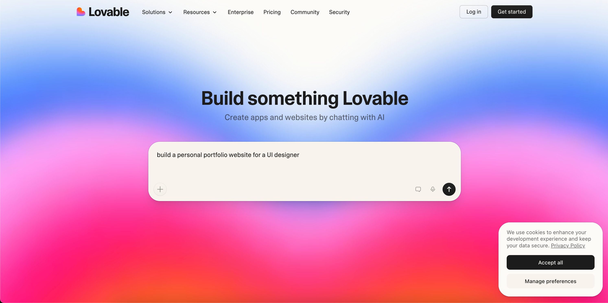
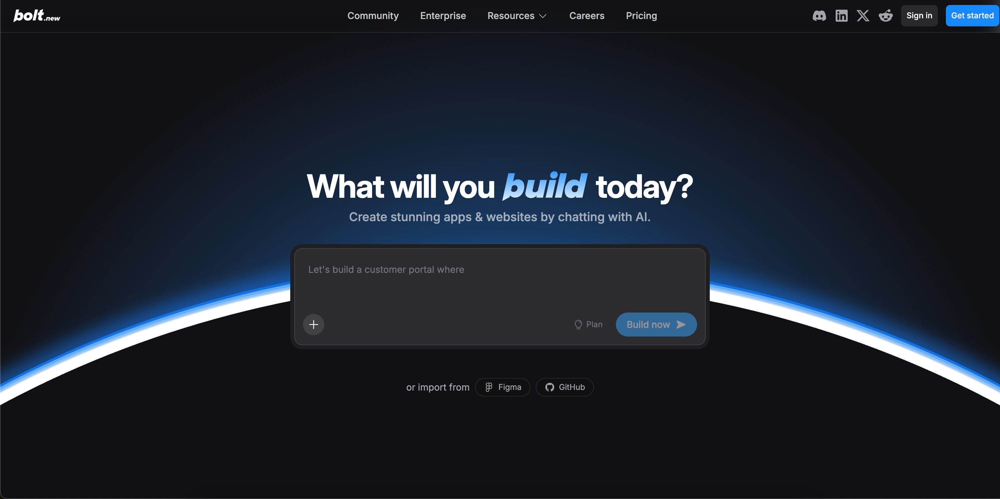
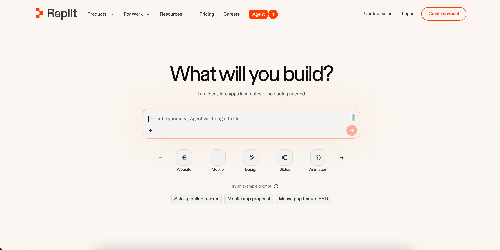

## Lovable vs v0 vs Bolt vs Replit vs [AutoCoder.cc](https://www.autocoder.cc/platform?utm_source=blog&utm_medium=latest&utm_campaign=bestAIWebBuilder4SEO)

AI coding tools are making it possible for anyone to build applications and websites using simple prompts. Platforms like **Lovable**, **v0**, **Bolt.new**, and **Replit** allow developers, startups, and indie hackers to generate entire products in minutes.

However, there is one critical factor many users overlook:

**Is the generated website actually SEO-friendly?**

Many AI-generated websites look impressive, but they struggle to rank on Google because their architecture makes it difficult for search engine crawlers to index content.

In this guide, we compare the SEO capabilities of popular AI website builders, analyze their underlying architectures, and explain what makes an AI-generated website truly SEO-friendly.

---

## Why SEO Matters for AI-Generated Websites

For many SaaS founders and indie hackers, organic search remains one of the most reliable acquisition channels.

According to research by BrightEdge:

> “Organic search drives **53% of all website traffic**, making it the largest digital channel.”

If your AI-generated website cannot be indexed properly, you lose access to:

- Google search traffic  
- Long-tail keyword traffic  
- Inbound leads  
- Organic discovery  

That is why **SEO capability is becoming a key differentiator among AI coding tools**.

---

## Key SEO Features an AI Website Builder Should Provide

To evaluate whether an AI website builder supports SEO, we need to examine several technical factors.

---

### Automatic SEO Metadata

Good platforms should generate:

- meta title  
- meta description  
- OpenGraph tags  
- canonical tags  

These elements help search engines understand page content and improve click-through rate in search results.

---

### Sitemap Generation

A **sitemap.xml** file tells search engines which pages exist on a website and how often they should be crawled.

Without a sitemap:

- new pages may be indexed slowly  
- important pages might be missed by crawlers  

---

### robots.txt Configuration

The **robots.txt** file controls how search engine bots crawl your site.

Proper configuration helps:

- avoid duplicate indexing  
- optimize crawl budget  

---

### SEO-Friendly URLs

Search engines prefer URLs containing clear keywords.

Example:
/ai-website-builder

instead of:
/page?id=1932

---

## Rendering Architecture

The most important technical factor affecting SEO is **how the page content is rendered**.

There are two main approaches.

---

## React SPA vs Next.js SSR: Why Architecture Matters for SEO

### React SPA (Single Page Application)

In SPA architecture:

- the browser initially loads an almost empty HTML page  
- content is rendered later by JavaScript  

This means search engines must execute JavaScript to see page content.

While Google can render JavaScript in many cases, the process is slower and less reliable.

This often leads to:

- slower indexing  
- weaker keyword rankings  

---

### Next.js SSR (Server-Side Rendering)

Frameworks like **Next.js** generate fully rendered HTML on the server.

Search engine crawlers can immediately see the page content without executing JavaScript.

Advantages include:

- faster indexing  
- better crawlability  
- improved SEO performance  

---

## AI Website Builder SEO Feature Comparison

The following table compares the SEO capabilities of major AI website builders, including metadata generation, sitemap support, and rendering architecture.

### SEO Capabilities Comparison of AI Website Builders

The table below compares how major AI website builders handle essential SEO infrastructure such as metadata generation, sitemap support, and rendering architecture.

| AI Website Builder | SEO Metadata | Sitemap | robots.txt | SEO-friendly URLs | Rendering Architecture |
|-------------------|-------------|--------|-----------|------------------|-----------------------|
| Lovable | ✅ Automatic | ✅ Automatic | ✅ Supported | ⚠️ Partial | React SPA |
| v0 | ⚠️ Manual | ⚠️ Manual | ⚠️ Manual | ⚠️ Manual | Next.js (SSR / SSG) |
| Bolt.new | ❌ Not provided | ❌ Not provided | ❌ Not provided | ❌ Not provided | React SPA |
| Replit | ❌ Manual implementation | ❌ Manual implementation | ❌ Manual implementation | ⚠️ Depends on developer | Depends on project |
| **AutoCoder.cc** | ⚠️ Planned / Partial | ⚠️ Planned | ⚠️ Planned | ⚠️ Planned | Next.js (CSR currently) |

---

## Lovable SEO Capabilities

Lovable provides one of the most complete SEO toolsets among AI website builders.

According to its documentation, Lovable supports automatic generation of:

- Meta title  
-Meta description  
- OpenGraph tags  
- Canonical tags  

It also provides tools for managing:

- sitemap.xml  
- robots.txt  

However, many Lovable-generated sites are built as **React SPA applications**, which may limit SEO performance compared with SSR-based frameworks.

---

## v0 SEO Capabilities

v0 generates applications using:

- React  
- Tailwind CSS  
- Next.js  

Because **Next.js supports SSR and Static Site Generation (SSG)**, websites generated through v0 can be significantly more SEO-friendly.

Search engines can access fully rendered HTML content immediately, improving indexing efficiency.

---

## Bolt.new SEO Limitations

Bolt.new focuses primarily on browser-based development.

Websites generated by Bolt are typically **React SPA applications rendered entirely in the browser**.

As a result:

- Search engines must execute JavaScript to view page content  
- Indexing performance can be inconsistent  

Bolt currently does not provide built-in automation for:

- SEO metadata  
- Sitemap generation  
- Robots configuration  

---

## Replit SEO Capabilities

Replit provides infrastructure rather than SEO automation.

The platform supports:

- Custom domains  
- HTTPS by default  
- Deployment hosting  

However, developers must manually implement:

- meta tags  
- sitemap.xml  
- robots.txt  

For beginners or non-technical users, this adds additional complexity.

---

## Where [AutoCoder.cc](https://www.autocoder.cc/platform?utm_source=blog&utm_medium=latest&utm_campaign=bestAIWebBuilder4SEO) Fits in the SEO Landscape

**[AutoCoder.cc](https://www.autocoder.cc/platform?utm_source=blog&utm_medium=latest&utm_campaign=bestAIWebBuilder4SEO)** is also built using modern frameworks like **Next.js**, which provides the foundation for building SEO-friendly applications.

Compared with pure React SPA architectures, Next.js allows developers to implement:

- server-side rendering (SSR)  
- static site generation (SSG)  
- optimized page performance  

This architecture enables search engines to access fully rendered HTML pages, improving crawlability and indexing potential.

As AI coding tools evolve, **[AutoCoder.cc](https://www.autocoder.cc/platform?utm_source=blog&utm_medium=latest&utm_campaign=bestAIWebBuilder4SEO) has an opportunity to introduce automated SEO capabilities**, such as:

- automatic metadata generation  
- keyword-based URL structures  
- AI-generated blog content  
- automatic sitemap submission  

These features could allow creators to launch **search-optimized applications immediately after generation**.

---

## The Future of SEO for AI Website Builders

Most AI website builders today focus on generating UI and functionality, but **SEO is still largely overlooked**.

The next generation of AI coding platforms will likely include:

- automated SEO optimization  
- AI-generated marketing content  
- built-in search engine submission  
- SEO scoring systems for generated pages  

These features would allow startups and creators to build not only functional products, but **discoverable products**.

---

## Conclusion

AI coding tools are transforming how software and websites are created.

But if your goal is to acquire **organic traffic**, choosing an AI website builder with strong SEO foundations is essential.

Key factors to evaluate include:

- rendering architecture  
- built-in SEO tooling  
- automation capabilities  

As the AI development ecosystem evolves, the platforms that combine **AI generation with built-in SEO intelligence** will likely gain a major advantage.

---

## FAQs About AI Website Builders and SEO

### 1. Are AI-generated websites good for SEO?

AI-generated websites can be SEO-friendly, but it depends heavily on the technical architecture of the platform used.

Websites generated with frameworks that support **server-side rendering (SSR)** or **static site generation (SSG)**—such as **Next.js**—tend to perform much better in search engines than sites built as pure React single-page applications (SPA).

---

### 2. Why do some AI website builders have poor SEO performance?

Many AI website builders generate websites using **React SPA architecture**, where the HTML page initially contains little or no content.

Search engines must execute JavaScript to render the page, which can delay indexing or cause incomplete crawling.

---

### 3. Is Next.js better for SEO than React SPA?

Yes.

Next.js is generally more SEO-friendly than React SPA because it supports **server-side rendering (SSR)** and **static site generation (SSG)**.

---

### 4. What SEO features should an AI website builder provide?

A good AI website builder should provide several built-in SEO features, including:

- automatic meta title generation  
- meta description generation  
- OpenGraph tags  
- sitemap.xml generation  
- robots.txt configuration  
- SEO-friendly URL structures  

---

### 5. Can AI coding tools automatically optimize SEO?

Some AI coding tools are beginning to introduce automated SEO capabilities, but most platforms still require users to manually configure many SEO settings.

---

### 6. Why is sitemap.xml important for SEO?

A **sitemap.xml** file helps search engines discover and crawl all the pages on a website.

---

### 7. What is robots.txt and why does it matter?

The **robots.txt** file tells search engine crawlers which parts of a website they are allowed to access and which parts should be ignored.

---

### 8. Do AI-generated websites rank well on Google?

Yes, if they follow proper SEO practices such as crawlable HTML, optimized metadata, and structured content.

---

### 9. What are common SEO mistakes in AI-generated websites?

Common mistakes include:

- JavaScript-only SPA pages  
- missing metadata  
- no sitemap.xml  
- poor URL structure  

---

### 10. How can AI website builders improve SEO in the future?

Future platforms will likely introduce:

- automated SEO metadata  
- AI keyword suggestions  
- automatic sitemap submission  
- AI-generated blog content