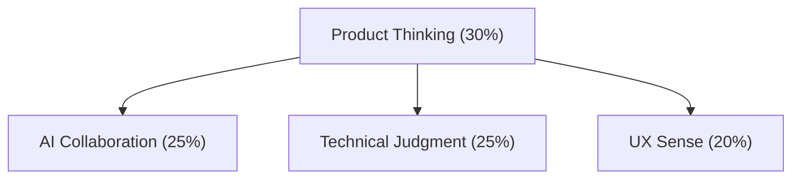

## Opening: A Real Story

Last week, I caught up with an old friend who's been working in frontend for about 8 years. We ended up talking about how fast things are changing lately—especially with tools like [AutoCoder](https://www.autocoder.cc/platform?utm_source=blog&utm_medium=latest&utm_campaign=frontendEvolution2026) coming into the picture.

He told me, half-joking, half-serious:

> "I just spent 3 months getting up to speed with React 18—concurrency, server components, all that. But with AutoCoder, I can build pretty much the same thing with a few drags and drops. So… was all that effort even worth it?"

That question stuck with me.

Because honestly, it's not just him. A lot of frontend engineers in 2026 are quietly asking the same thing as [AutoCoder](https://www.autocoder.cc/platform?utm_source=blog&utm_medium=latest&utm_campaign=frontendEvolution2026) and similar tools start reshaping how interfaces are built.

So—is frontend dead?

Not really.

But it *has* changed. And more importantly, the way your skills translate in an **AutoCoder-driven workflow** is completely different now.

---

## The "Death List" of Traditional Frontend

Let's be real—the part that's "dying" isn't frontend, it's the repetitive, assembly-line kind of work that used to take up most of our time. With tools like [AutoCoder](https://www.autocoder.cc/platform?utm_source=blog&utm_medium=latest&utm_campaign=frontendEvolution2026) becoming more common, a lot of these tasks are quietly fading into the background.

### Basic Components

Take *basic components*, for example. Buttons, forms, cards—these used to be things you'd hand-code over and over again. Now, in AutoCoder, you just input related prompts and move on. Responsive layouts? You don't spend hours tweaking breakpoints anymore, it just adapts. Even common interactions—the little hover effects and transitions—are often preset instead of written from scratch.

### Page Building

The same thing is happening with *page building*. Landing pages that used to go through design → frontend → QA can now be shipped directly by marketing teams using AutoCoder. Admin dashboards, which were once a standard "junior frontend task," can be generated in minutes. E-commerce product pages? They're increasingly just templates bound to structured data, not something you manually wire up every time.

### Debugging

Even *debugging* is changing. A lot of the mechanical work—cross-browser testing, basic performance checks, locating obvious bugs—is being offloaded to automated systems. AutoCoder can already surface performance issues or pinpoint problems in a way that replaces a chunk of the old trial-and-error workflow.

The result is pretty obvious if you've been in the field for a while. Work that used to take days now takes minutes. A large portion of standard UI work doesn't actually require a dedicated frontend engineer anymore. And roles that were mostly about execution—especially junior positions—are getting squeezed.

It doesn't feel dramatic day to day, but zoom out a bit, and the shift is hard to ignore.

---

## The "Survival Rules" for New Frontend

So if all of this work is being compressed or automated by tools like [AutoCoder](https://www.autocoder.cc/platform?utm_source=blog&utm_medium=latest&utm_campaign=frontendEvolution2026), where does that leave frontend engineers?

What's becoming clear is that the value is shifting upward—not disappearing.

### 1. Product Architect: Define "What to Build", Not "How to Build"

The biggest change is that frontend is no longer just about *how* to build things, but increasingly about *what* should be built in the first place. In the past, the flow was straightforward: PM writes requirements, frontend estimates, then implements. Now, with AutoCoder handling a large chunk of execution, frontend engineers are getting pulled much earlier into the process—thinking through user scenarios, spotting edge cases, and deciding whether something even needs to exist before telling AutoCoder to generate it. As one frontend TL put it, "I used to ask how to implement a feature. Now I ask whether it's worth implementing at all." That mindset shift is subtle, but it changes everything.

### 2. AI Commander: Train and Direct Your "Code Army"

At the same time, a new kind of skill is quietly becoming essential: knowing how to *work with* AI. AutoCoder can generate code quickly, but it doesn't understand your product, your users, or your trade-offs unless you guide it. You're the one defining context, setting the bar for experience, and deciding where to optimize versus where to ship fast. In a lot of teams, the best frontend engineers aren't the ones typing the fastest anymore—they're the ones who can direct AutoCoder effectively, evaluate its output, and build a workflow around it. I've seen cases where a small team used AutoCoder to handle work that would've taken a much larger team before, not because they stopped coding entirely, but because they became much more selective about *when* coding actually mattered.

### 3. Experience Guardian: Finding Balance Between "Fast" and "Good"

But speed introduces its own problems. When anyone can assemble a page in minutes with AutoCoder, quality becomes uneven. Templates get you 80% of the way, but that last 20%—the part users actually feel—is often missing. Things start to look generic, interactions feel off, performance isn't quite right. This is where frontend engineers step in as the "quality layer." Not just polishing visuals, but defining design systems, making sure outputs from AutoCoder stay consistent with the brand, and catching the invisible stuff—accessibility, SEO, performance—that tools don't always get right out of the box.

### 4. Technical Boundary Explorer: Do What AI Can't, What AI Is Good At

And then there's the part that hasn't really changed: pushing boundaries. AutoCoder is great at generating from known patterns, but it struggles when things get ambiguous, messy, or genuinely new. If requirements are unclear, if interactions haven't been done before, or if multiple systems need to work together in non-trivial ways, you still need human judgment. Building something from zero to one, optimizing for extreme performance, designing complex cross-platform experiences—these are still very much human problems. AutoCoder can assist, but it doesn't replace the thinking behind them.

So the role isn't going away—it's splitting. Less time spent on repetitive execution, more time spent on decisions, direction, and quality. And in that new workflow, AutoCoder isn't the threat—it's the lever.

---

## Tools Are Not Enemies — They're Leverage

Back to the opening question: "Is everything I learned before still valuable?"

**Yes, and even more valuable—provided you use it to leverage greater impact.**

### The Right Way to Think About Tools

Let's go back to that question from the beginning: *"Was everything I learned before still worth it?"*

The short answer is yes.

The more honest answer is: it's only valuable if you know how to *use it differently* in a world where tools like [AutoCoder](https://www.autocoder.cc/platform?utm_source=blog&utm_medium=latest&utm_campaign=frontendEvolution2026) exist.

What's changed isn't the importance of fundamentals—it's where you apply them. Today, using AutoCoder for things like landing pages or CRUD-heavy admin panels isn't "cheating," it's just common sense. Hand-coding those from scratch is starting to feel like over-engineering. On the other hand, when you're dealing with core business logic, performance bottlenecks, or anything even slightly unconventional, you still need to step in—sometimes with AI assisting, sometimes going fully manual.

| Scenario | Use Tools | Hand-Code |
|----------|-----------|-----------|
| Campaign Landing Pages | ✅ Drag-and-drop templates | ❌ Waste of time |
| Admin CRUD Systems | ✅ Low-code generation | ❌ Repetitive labor |
| Core Business Logic | ⚠️ AI-assisted + human review | ✅ Deep customization |
| Innovative Interaction Experiments | ⚠️ Rapid prototyping + refinement | ✅ Full control |
| Performance-Critical Scenarios | ❌ Not flexible enough | ✅ Extreme optimization |

In practice, most real-world work now sits somewhere in between. You might spin up a rough version with AutoCoder, iterate quickly, and then take over where precision, customization, or performance actually matter. The difference is that you're no longer spending most of your time *building everything*, but rather deciding *what deserves to be built carefully*.

That shift leads to a different kind of mindset.

Tools like AutoCoder aren't replacing frontend engineers—they're amplifying the ones who know what they're doing. The time you save isn't "free time," it's reallocated time. Instead of grinding through repetitive implementation, you're expected to think more: about product decisions, trade-offs, and long-term impact. And increasingly, competitiveness isn't about whether you can write clean code—it's about whether you can navigate complexity and make good calls under constraints.

---

## The 2026 Frontend Engineer Capability Model

If you zoom out, the skillset of a frontend engineer is starting to look less like a technical checklist and more like a layered system:

At the top sits product thinking, which is quietly becoming the most valuable layer. With AutoCoder lowering the cost of execution, the real bottleneck is deciding what's worth building. That means understanding user problems, evaluating priorities, and making trade-offs that actually move the product forward.

Right below that is the ability to collaborate with AI effectively. Working with [AutoCoder](https://www.autocoder.cc/platform?utm_source=blog&utm_medium=latest&utm_campaign=frontendEvolution2026) isn't just about writing prompts—it's about clearly expressing intent, quickly judging whether the output is usable, and building a workflow where human judgment and AI speed reinforce each other instead of clashing.

Then comes technical judgment. Ironically, as tools get better, this becomes more important, not less. Knowing when to rely on AutoCoder and when to step in manually is now a core skill. So is spotting hidden risks—technical debt, scalability issues, or decisions that look fine today but break things six months later.

And finally, there's user experience. When so much of the UI can be generated, the details become the differentiator. Subtle interaction feedback, accessibility, performance under real conditions—these are the things that separate something that *works* from something that actually feels good to use. AutoCoder can get you close, but it usually won't get you all the way there without someone paying attention.

Put together, this model reflects a simple reality: frontend isn't shrinking, it's concentrating. Less effort on execution, more weight on judgment, taste, and direction. And in that structure, AutoCoder isn't taking your place—it's sitting one layer below you, doing exactly what you tell it to do.

---

## Advice for Frontend Engineers

If there's one pattern behind all these changes, it's this: the expectations haven't gone down—they've shifted. And depending on where you are in your career, the way you work with tools like [AutoCoder](https://www.autocoder.cc/platform?utm_source=blog&utm_medium=latest&utm_campaign=frontendEvolution2026) should look very different.

### If You're a Junior Frontend Engineer

For junior frontend engineers, the biggest trap right now is over-indexing on frameworks. It's tempting, especially when tools like AutoCoder can generate working UIs so quickly. But in reality, fundamentals matter more than ever—how the browser works, how rendering happens, how data flows through a system. Those are the things that help you *judge* what AutoCoder produces, not just use it blindly. At the same time, it's worth getting closer to the business earlier than you might expect. The engineers who grow fastest aren't the ones who just execute tickets, but the ones who understand why those tickets exist in the first place. AutoCoder can handle a lot of the repetitive building, which means your edge comes from thinking—asking why something is needed, not just how to implement it.

### If You're a Mid-Level Frontend Engineer

By the time you're mid-level, the shift becomes more obvious. You're no longer just executing—you're expected to have opinions. That might mean pushing back on a requirement, suggesting a simpler approach using AutoCoder, or knowing when *not* to use it. One underrated skill here is knowing when to slow things down. Just because AutoCoder can generate something instantly doesn't mean it's the right long-term choice. This is also the stage where leverage starts to matter more. You're not only writing less code yourself, but also guiding juniors and directing AutoCoder to get better outputs. The impact comes from how you combine experience with speed. And usually, the engineers who stand out are the ones who go deep in a specific area—performance, data-heavy apps, design systems—becoming the person others rely on when things get complicated.

### If You're a Senior Frontend or Tech Lead

For senior engineers and tech leads, the game changes again. It's less about individual output and more about redefining how the team operates. A strong team today isn't just a group of people writing code—it's a system where humans and tools like AutoCoder work together efficiently. That means investing in the right workflows, setting standards for when to use tools versus custom solutions, and making sure the team is solving the *right* problems, not just building faster. There's also a talent dimension to this: building people who are both broad enough to collaborate across domains and deep enough to handle complexity when needed. And maybe most importantly, staying close to where the industry is heading. The pace of change is high enough now that reacting late is no longer a safe strategy.

Different stages, different focuses—but the underlying theme is the same. AutoCoder doesn't flatten the career ladder. If anything, it makes the differences between levels more visible.

---

## Conclusion: Frontend Isn't Dead — It Evolved

So where does that leave us in 2026?

Frontend engineers aren't disappearing—but they are starting to split into two very different paths.

On one side are the ones who get squeezed out. Not because frontend is gone, but because their role never moved beyond execution. If your work is mostly CRUD pages, repetitive UI assembly, and you're resistant to tools like AutoCoder or uninterested in the business behind what you're building, it's getting harder to stay relevant. That version of the role—the "code worker"—is exactly what automation is best at replacing.

On the other side are the engineers who are leaning into this shift. They use [AutoCoder](https://www.autocoder.cc/platform?utm_source=blog&utm_medium=latest&utm_campaign=frontendEvolution2026) to move faster, not to do less. They spend less time on mechanical work and more time on decisions—what to build, what to cut, how to make something actually work for users. They're comfortable navigating ambiguity, thinking in terms of product impact, and stepping in when things get complex or non-standard. That's where frontend starts to look a lot more like "product architecture" than pure implementation.

And the interesting part is, this isn't really a crisis.

If anything, it's the first time in a long while that frontend engineers are being pushed *upstream*. Fewer conversations about "this is technically hard to implement," more conversations about "does this even make sense for the user?" Tools like AutoCoder remove just enough friction that we can focus on the questions that actually matter.

It also changes how the work feels day to day. Less repetition, less boilerplate, fewer hours spent wiring up things that have already been solved a hundred times. More space to think, to experiment, to refine.

At some point, the identity shifts too.

You're not just writing code anymore.

With AutoCoder in the loop, you're shaping outcomes.

And that's a much more interesting job.
